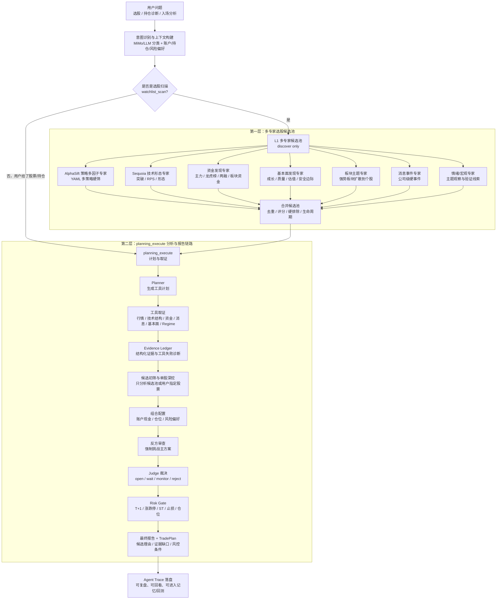

# Stock Analysis

一个面向个人投资者的本地股票研究 Agent。它的目标不是生成一篇“看起来很完整”的分析报告，而是把选股、个股诊断和账户决策拆成可追溯、可审计、可复盘的流程：先找候选，再取证，再辩论，再过风控，最后形成带条件的交易计划。

当前分支重点服务 A 股研究，同时保留港股、美股等原有能力。系统仍处于个人研究和开发调试阶段，不构成投资建议。

## 为什么做这个

普通股票 AI 工具常见的问题是：

- 直接给结论，但不知道它看了哪些证据。
- 会把“候选股”说成“推荐买入”。
- 不理解账户仓位、成本、T+1、涨跌停和止损纪律。
- 工具失败时仍然输出很自信的判断。
- 每次分析都是一次性文本，事后无法复盘这个判断到底靠不靠谱。

这个项目的核心思路是把 AI 从“报告生成器”升级为“交易研究流程助手”。LLM 负责解释、对比、辩论和裁决；数据获取、结构识别、风控约束和审计记录尽量用确定性程序完成。

## 已经做出的创新能力

### 1. 账户感知，而不是泛泛问股

Agent 可以读取账户、持仓、现金、成本、仓位上限、回撤约束和风险偏好。相同股票对不同账户会得到不同建议：重仓被套、空仓观察、低仓位试错，对应的动作不应该一样。

系统支持的主要分析意图：

| 场景 | 输出重点 |
| --- | --- |
| 持仓诊断 | 持有、加仓、减仓、止盈、止损、继续观察的条件 |
| 未持仓入场 | 是否值得入场、入场区间、首仓比例、止损和淘汰条件 |
| 选股扫描 | 候选发现、初筛、深度分析、组合配置和最终排序 |
| 风险复查 | 账户集中度、仓位、回撤、数据缺口和风控阻断 |
| 事件影响 | 新闻、政策、行业事件对持仓或候选股的影响 |

### 2. 先规划再执行，避免模型边想边乱查

`planning_execute` 模式会先识别任务意图，再生成能力需求和工具计划，然后逐步取证。它不会在没有候选池、没有行情证据、没有资金或消息证据时直接输出买卖结论。

每次运行都会保存 Trace，包括用户输入、账户上下文、Planner、工具调用、证据账本、选股阶段结果、Debate、Risk Gate 和最终报告。后续可以复盘“这个结论是怎么来的”。

### 3. 候选池不再硬编码

选股时如果用户没有给股票代码，系统会先生成候选池，而不是让模型凭印象编股票。

当前候选发现融合了几类来源：

- AlphaSift YAML 多因子策略：可配置硬筛、因子打分、策略标签。
- Sequoia 风格形态策略：均线放量、海龟突破、高窄旗形、涨停洗盘、上升趋势跌停错杀、RPS 强势突破。
- 强势板块成分股：从市场热点中补充候选。
- 用户自选池：用户给出的股票优先。
- fallback 种子池：只在所有候选源失败时兜底，保证流程可继续取证。

候选只代表“值得进一步分析”，不代表推荐买入。最终排序必须经过单股行情、技术结构、资金、消息、基本面和账户约束验证。

### 4. 强制反方辩论，不让单边叙事直接过关

工具证据形成后，系统会进入强制对抗式 Debate：

- Primary：提出主观点，例如开仓、持有、加仓或等待。
- Opposing：必须站在反方向，挑战主观点的风险和证据缺口。
- Judge：基于同一份证据裁决，不做简单折中。

这样可以减少“只挑支持自己观点的证据”的问题。特别是在追高、板块退潮、工具失败、数据不足时，Judge 可以裁定等待、拒绝或只监控。

### 5. A 股硬风控闸门

LLM 不能绕过风控。系统已经实现确定性 `risk_gate`，用于检查：

- T+1 约束。
- 涨停禁追和跌停不可假定立即成交。
- ST、退市风险、特殊上市状态。
- 是否有止损或失效条件。
- 单股仓位、总仓位、现金和账户风险。
- 关键数据缺失或工具失败。

如果风控不通过，报告可以解释原因，但不能把阻断动作包装成可执行交易。

### 6. 市场环境状态机

市场不是只有涨和跌。系统新增了 A 股 `detect_market_regime`，用于判断当前环境是否适合主动开仓、追趋势或提高仓位。

它综合：

- ATR% 的历史经验分位，而不是固定阈值。
- 波动状态阻尼，避免单根异常 K 线导致状态剧烈翻转。
- 北向资金、两融、市场主力资金、指数宽度等 A 股情绪替代分量。
- Wyckoff 相位识别，区分吸筹、拉升、派发、下跌和震荡。
- SQLite 持久化确认，要求新状态连续确认后才切换。

在 `risk_off`、`panic` 或极端波动状态下，选股链路会自动降低开仓激进度。

### 7. 价格结构分析不只看均线

系统新增 Stage3 价格结构工具 `analyze_price_structure`，输出确定性结构证据，而不是直接硬编码买卖点。

当前包括：

- 缠论流水线：K 线包含关系合并、顶底分型、笔、中枢、力度对比、未完成笔。
- SMC 结构：摆动点、HH/HL/LH/LL、BOS、CHoCH、Order Block、FVG。
- MACD 柱面积和价格幅度对比，用来辅助判断力度变化。

结构工具只回答“价格结构发生了什么”，最终怎么用仍交给账户约束、市场环境、资金消息和 Judge 共同决定。

### 8. 资金流和工具失败有明确诊断

`get_capital_flow` 已优先接入 StockAPI 历史资金流 `codeFlow`，减少对不稳定东方财富端点的依赖。筹码、资金等工具失败时会返回结构化错误，而不是在 Trace 里假装成功。

这对 Agent 很重要：数据缺口本身就是交易风险，必须进入最终结论。

### 9. 长期记忆和复盘底座

Graphiti/Neo4j 可选集成已经接入最小链路。系统可以把每次 agent-trace 运行写成 episode，沉淀股票、板块、事件、结论和关系，为后续连续对话、历史观点检索、策略复盘和自进化做准备。

不开 Graphiti 时，主分析链路仍可运行。

## 当前系统框架

你现在看到的系统可以理解为两层协作框架：

- 第一层是 **L1 多专家选股候选池**：只负责发现“哪些股票值得进入候选池”，不做买入结论。
- 第二层是 **planning_execute 分析与报告链路**：理解用户问题、注入账户约束、对候选或单股逐步取证，最后输出报告和交易计划。



第一层和第二层的边界很重要：候选池专家只回答“为什么这只股票进入候选”，不能回答“现在能不能买”；是否可以买、怎么买、仓位多少、什么条件下放弃，必须进入第二层的取证、反方审查、Judge 和 Risk Gate。

## 一次完整分析会发生什么

```text
用户问题 / 选股需求 / 持仓诊断
  -> 注入账户、持仓、风险偏好和交易约束
  -> Planner 生成工具计划
  -> 候选发现或单股取证
  -> 行情、技术、结构、资金、消息、基本面取证
  -> 形成 Evidence Ledger
  -> Primary / Opposing / Judge 对抗裁决
  -> Risk Gate 确定性风控检查
  -> 输出最终报告和 TradePlan
  -> Trace 落盘，后续进入记忆、回测和复盘
```

## 当前适合怎么用

当前最适合三类使用方式：

1. 持仓复查：今天这只股票还能不能拿，什么时候减仓，什么情况必须止损。
2. 入场分析：某只股票现在能不能买，首仓多少，错了怎么办。
3. 选股研究：从候选池中找出值得继续观察或小仓试错的标的，并明确不买的原因。

建议主要使用 Web 的 Agent Trace 页面：

```text
http://127.0.0.1:5173/agent-trace
```

它会展示每一步工具调用、候选来源、证据、辩论、风控和最终结果，比普通聊天窗口更适合做交易研究。

## 未来规划

这个项目后续不是简单增加更多工具，而是继续往“可验证的个人交易研究系统”演进。

### 1. 方案保存

把每次分析生成的 `TradePlan` 保存成机器可读方案，包括入场区间、首仓比例、加仓条件、止损条件、淘汰条件、复查时间和风控状态。这样报告不再是一次性文本，而是可跟踪对象。

### 2. 模拟盘托管

让系统在模拟盘中跟踪方案是否触发、是否执行、最大浮盈、最大回撤、是否按止损退出、是否偏离原计划。重点不是自动赚钱，而是验证“当时的判断后来有没有被市场证明”。

### 3. MFE / MAE / Trust Score

用最大有利波动、最大不利波动、持有期表现、止损命中、目标命中等指标给策略和工具组合打分。以后不是只问“这次分析像不像”，而是问“这个信号历史上可靠不可靠”。

### 4. 回测系统

对候选策略、市场 Regime、价格结构、资金流、Debate Judge 和 Risk Gate 做历史回测。回测结果会反向影响策略权重，而不是靠 prompt 感觉调参。

### 5. 策略库

把有效的候选逻辑沉淀为可版本化策略：AlphaSift YAML、多因子硬筛、Sequoia 形态策略、Regime 过滤、结构确认、资金确认、事件催化过滤。每个策略都应该有参数、适用环境、历史表现和失效条件。

### 6. 连续对话和个人偏好记忆

让 Agent 记住你过去关注过什么、哪些行业不碰、可接受的回撤、常用仓位、历史上哪些判断被推翻。目标是减少重复解释，让系统越来越贴近个人交易习惯。

### 7. 自进化提案

当模拟盘和回测积累足够样本后，系统可以提出策略改进建议，例如某类信号在高波动 regime 中胜率下降、某个资金流字段滞后、某个候选策略需要增加成交额过滤。改动仍需要人工确认，不让模型自动改生产规则。

### 8. 真实交易接口

真实交易是最后阶段。只有当方案保存、模拟盘、回测、风控、审计日志和人工确认机制足够稳定后，才考虑接入真实交易接口。默认方向是先做半自动：系统给条件计划和风控结论，人确认后执行。

## 本地启动

推荐使用 uv：

```bash
uv venv
uv pip install -r requirements.txt
cp .env.example .env
./start_all.sh
```

启动后访问：

- Web：`http://127.0.0.1:5173`
- 后端 API：`http://127.0.0.1:8000`
- Agent Trace：`http://127.0.0.1:5173/agent-trace`
- Neo4j Browser：`http://127.0.0.1:7474/browser/`

停止：

```bash
./stop_all.sh
```

如果只需要后端：

```bash
python main.py --serve-only
```

## 关键配置

最少需要配置一个可用 LLM：

```env
AGENT_MODE=true
AGENT_ANALYSIS_MODE=planning_execute

OPENAI_API_KEY=
OPENAI_BASE_URL=
OPENAI_MODEL=
```

候选池增强可选配置：

```env
SEQUOIA_CANDIDATE_DB_PATH=Sequoia-X/data/sequoia_v2.db
ALPHASIFT_STRATEGY_DIR=alphasift/alphasift/strategies
ALPHASIFT_CANDIDATE_DB_PATH=Sequoia-X/data/sequoia_v2.db
```

Graphiti 长期记忆可选配置：

```env
GRAPHITI_ENABLED=false
NEO4J_URI=bolt://localhost:7687
NEO4J_USER=neo4j
NEO4J_PASSWORD=changeme
GRAPHITI_EMBEDDING_MODEL=
GRAPHITI_EMBEDDING_BASE_URL=
GRAPHITI_EMBEDDING_API_KEY=
GRAPHITI_GROUP_STRATEGY=market
```

环境检查：

```bash
python test_env.py
python test_env.py --graph
```

完整配置见 [.env.example](.env.example) 和 [完整指南](docs/full-guide.md)。

## 相关文档

- [Agent 用户上下文与分阶段改造计划](docs/agent-user-context-plan.md)
- [Agent 工具能力缺口分析](docs/agent-tool-gap-analysis.md)
- [A 股 Regime 状态机原理](docs/regime-state-machine.md)
- [Stage3 价格结构分析引擎原理](docs/price-structure-engine.md)
- [阶段化选股 Prompt 设计](docs/agent-stock-selection-prompts.md)
- [Graphiti 时序知识图谱集成计划](docs/graphiti-integration-plan.md)
- [更新日志](docs/CHANGELOG.md)

## 免责声明

本项目仅用于个人学习、研究、复盘和模拟验证，不构成任何投资建议。股票市场存在本金亏损风险，任何分析、模拟盘或未来交易接口都需要使用者自行承担风险。
